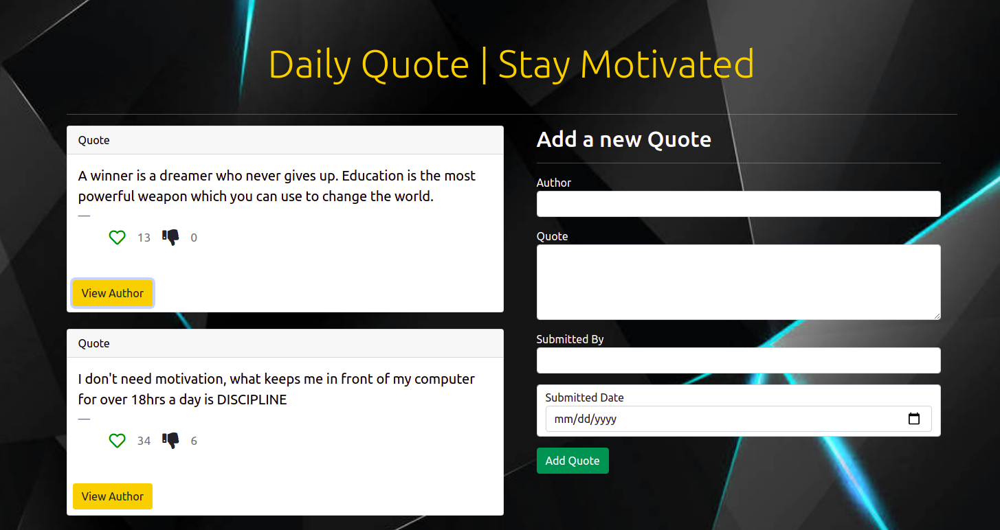

# DailyQuote

This project was generated with [Angular CLI](https://github.com/angular/angular-cli) version 12.2.1.

## Author

[FidelMunywoki](https://github.com/FidelMunywoki)

### Version
08.2020/01.0

## Description

This is a web app build with angular and which allows a user to see uploaded quotes, like, dislike and add his/her favorite quote. 

## Development server

Run `ng serve` for a dev server. Navigate to `http://localhost:4200/`. The app will automatically reload if you change any of the source files.

## Live Page 

Edit

## Screen Shot

## Installation / Setup instruction

1. Fork from github repository: https://github.com/FidelMunywoki/daily-quote.git
2. Clone the same link to your local repository.
3. work on the files locally via VScode.
4. Run via terminal by typing ng serve -o to launch the app.

## Technologies Used

* [HTML5]
* [CSS]
* [Bootstrap5]
* [Javascript]
* [AngularJs]

## Known Bugs

* We are working on making the page dynamic

## Contact Information 

If you have any question or contributions that would better this app, please email me at [fidelis.munywoki@student.moringaschool.com]

## License
* *MIT License:*
* Copyright (c) 2021 **Fidel Munywoki**